---
## Front matter
lang: ru-RU
title: "Отчет по лабораторной работе №1"
author: |
	Artyom Gennadievich Yeryomenko
institute: |
	RUDN University, Moscow, Russian Federation

## Formatting
toc: false
slide_level: 2
theme: metropolis
header-includes: 
 - \metroset{progressbar=frametitle,sectionpage=progressbar,numbering=fraction}
 - '\makeatletter'
 - '\beamer@ignorenonframefalse'
 - '\makeatother'
aspectratio: 43
section-titles: true
---

# **Цель выполнения лабораторной работы**

## Цель

Приобретение практических навыков установки операционной системы на виртуальную машину, настройки минимально необходимых для дальнейшей работы сервисов.

# **Результаты выполнения лабораторной работы**

## Менеджер VirtualBox

{ #fig:001 width=70% }

## Окно «Свойства» VirtualBox

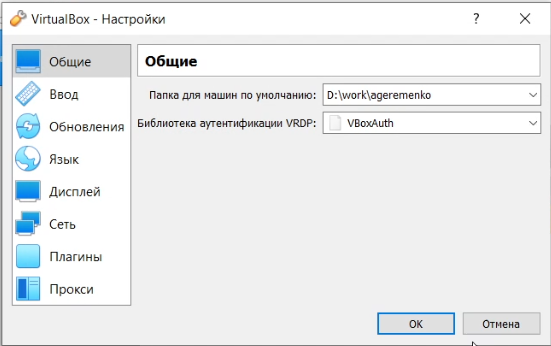{ #fig:002 width=70% }

## Создание новой виртуальной машины

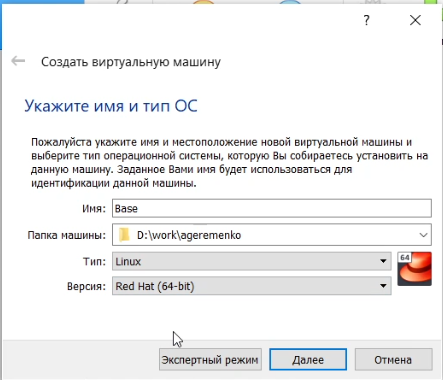{ #fig:003 width=40% }

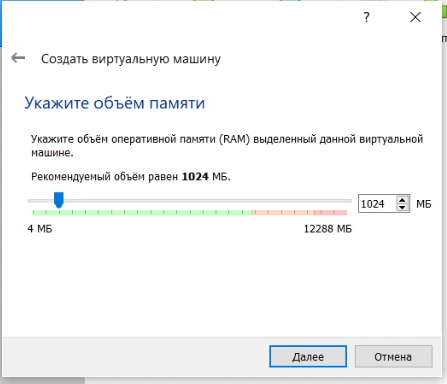{ #fig:004 width=40% }

## Конфигурация жёсткого диска

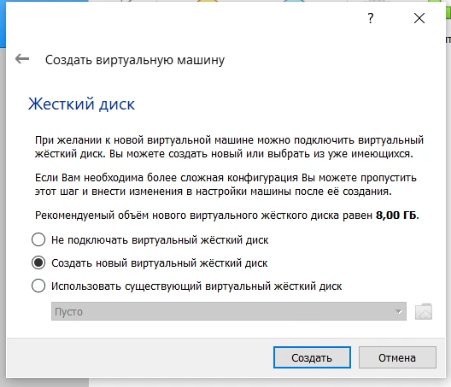{ #fig:005 width=30% }

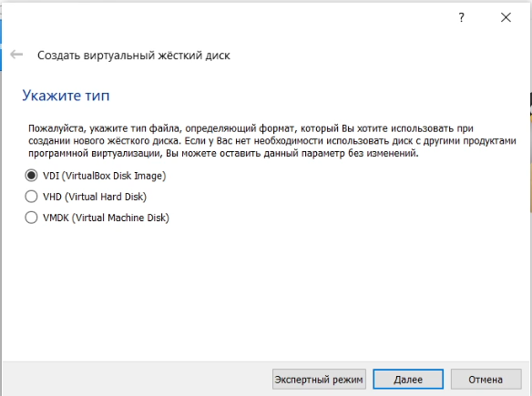{ #fig:006 width=30% }

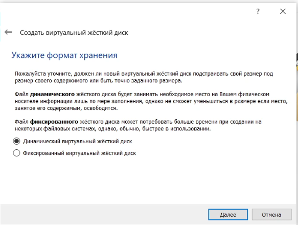{ #fig:007 width=30% }

## Конфигурация виртуального диска

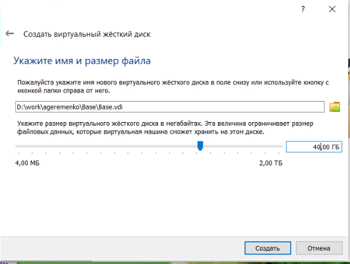{ #fig:008 width=70% }

## Проверка пути к снимкам системы

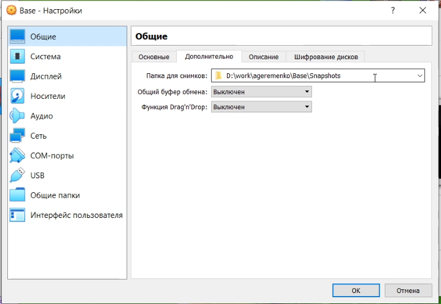{ #fig:009 width=70% }

## Загрузка установочного образа системы

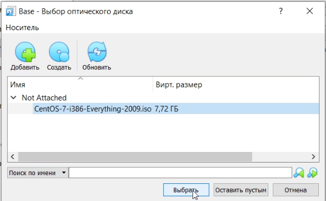{ #fig:010 width=70% }

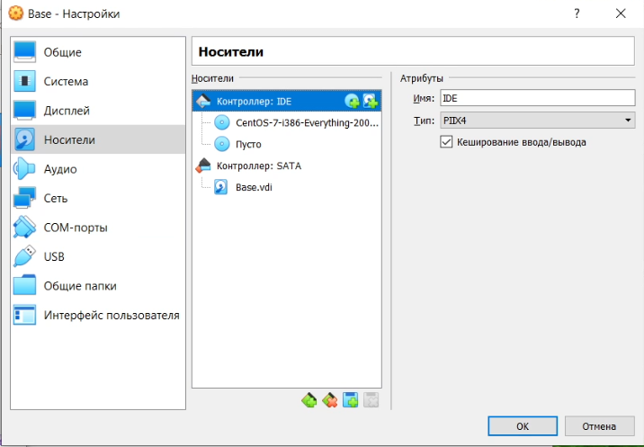{ #fig:011 width=70% }

## Запуск установки системы

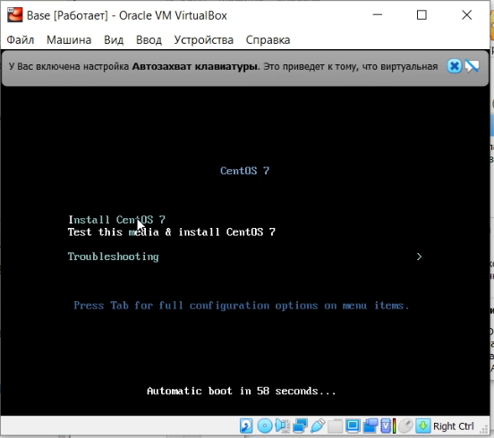{ #fig:012 width=70% }

## Установка языка интерфейса и клавиатуры

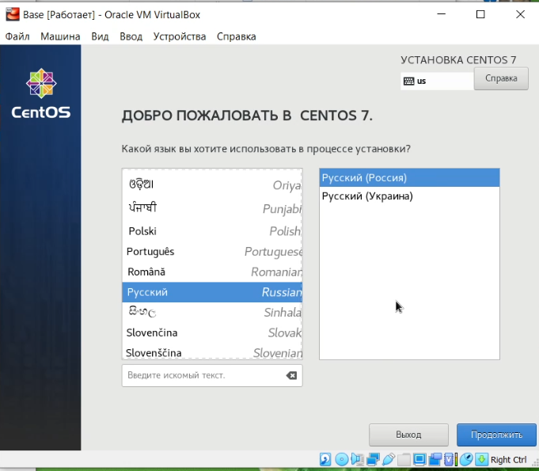{ #fig:013 width=40% }

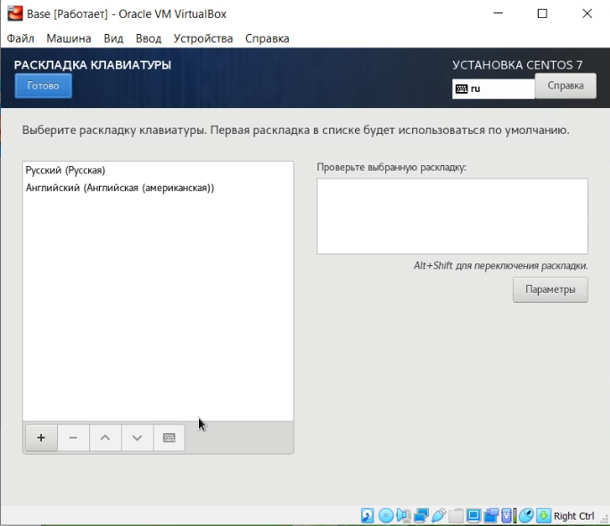{ #fig:014 width=40% }

## Конфигурация жёсткого диска

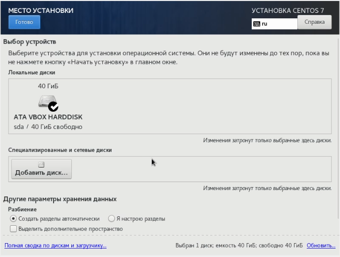{ #fig:015 width=70% }

## Установка пароля для root

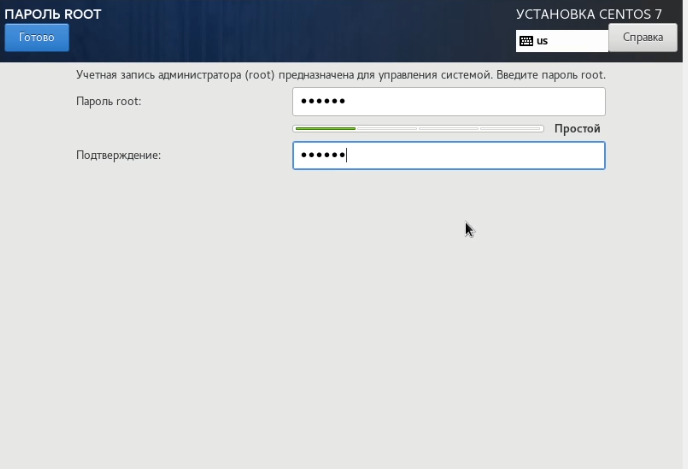{ #fig:016 width=70% }

## Первый запуск и настройка системы

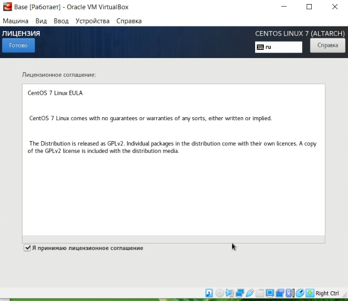{ #fig:017 width=40% }

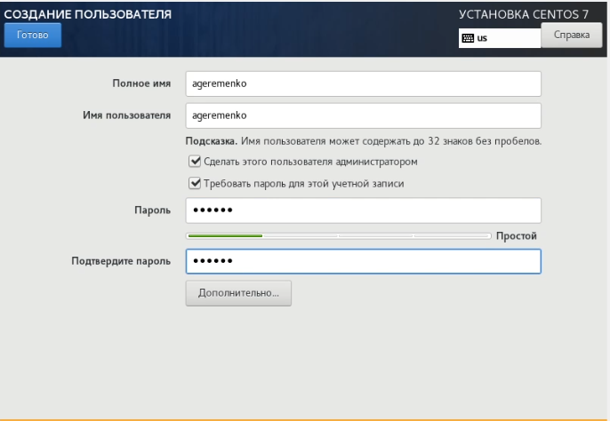{ #fig:018 width=40% }

## Подключение к виртуальной машине

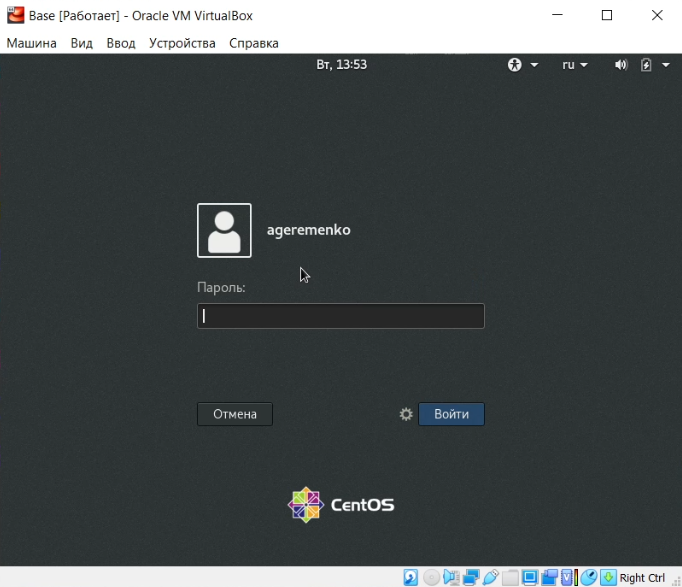{ #fig:019 width=60% }

## Установка пакета обновлений и mc

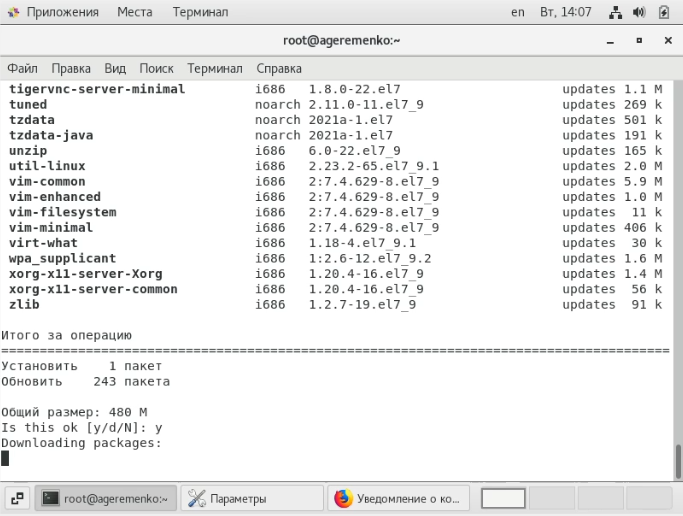{ #fig:020 width=60% }

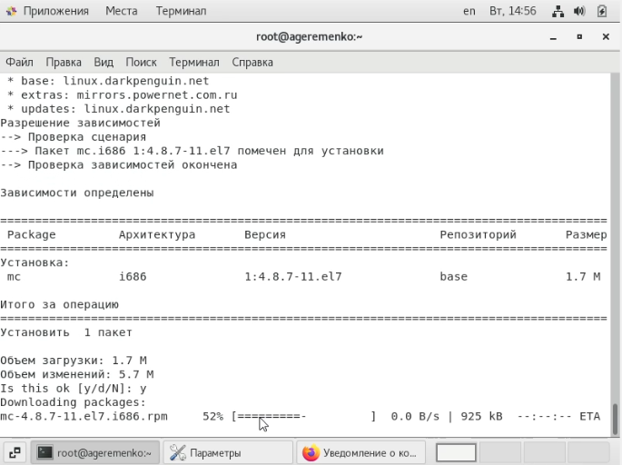{ #fig:021 width=60% }

## Настройка машины Base как базовой

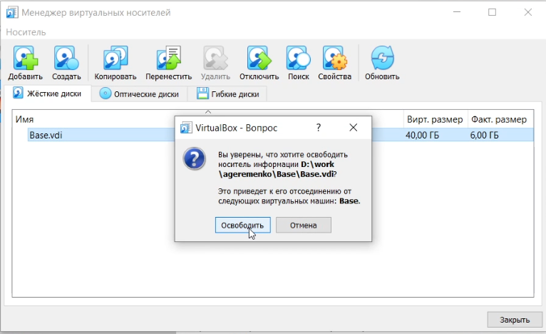{ #fig:022 width=60% }

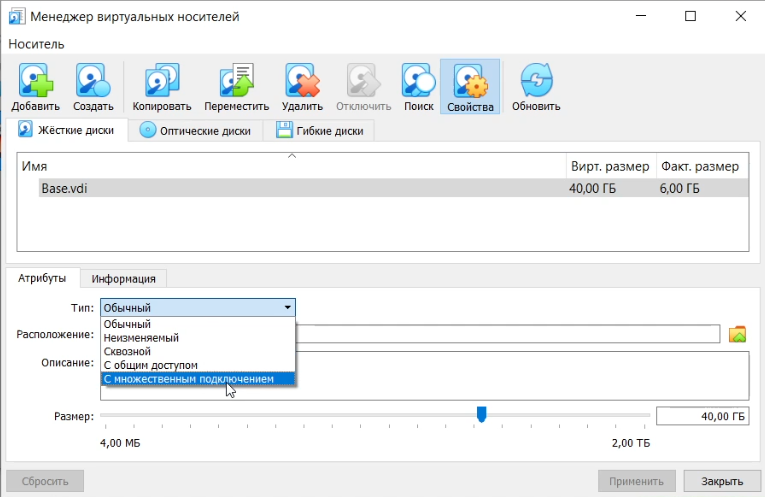{ #fig:023 width=60% }

## Создание машины Host2

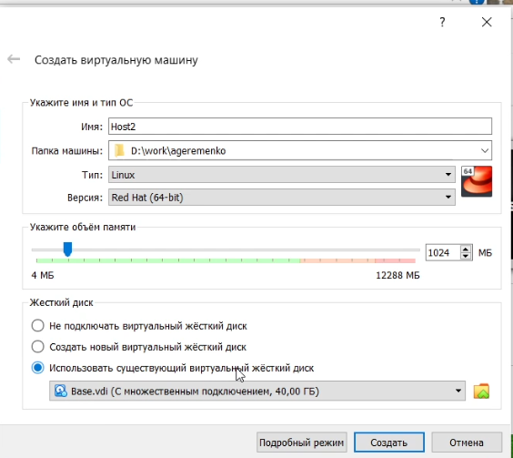{ #fig:024 width=60% }

## Выводы

Проделав данную лабораторную работу я приобрёл практические навыки установки операционной системы на виртуальную машину, настройки минимально необходимых для дальнейшей работы сервисов.
