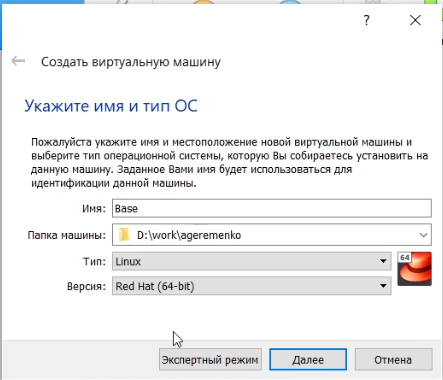
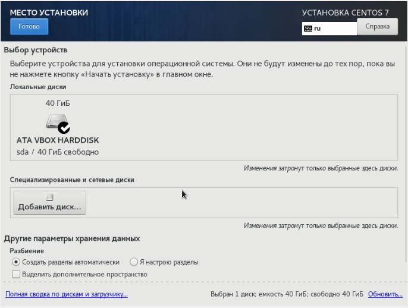

---
# Front matter
lang: ru-RU
title: "Отчёт по лабораторной работе №1"
subtitle: "дисциплина: Информационная безопасность"
author: "Ерёменко Артём Геннадьевич, НПИбд-01-18"

# Formatting
toc-title: "Содержание"
toc: true # Table of contents
toc_depth: 2
lof: false # List of figures
lot: false # List of tables
fontsize: 12pt
linestretch: 1.5
papersize: a4paper
documentclass: scrreprt
polyglossia-lang: russian
polyglossia-otherlangs: english
mainfont: PT Serif
romanfont: PT Serif
sansfont: PT Sans
monofont: PT Mono
mainfontoptions: Ligatures=TeX
romanfontoptions: Ligatures=TeX
sansfontoptions: Ligatures=TeX,Scale=MatchLowercase
monofontoptions: Scale=MatchLowercase
indent: true
pdf-engine: lualatex
header-includes:
  - \linepenalty=10 # the penalty added to the badness of each line within a paragraph (no associated penalty node) Increasing the value makes tex try to have fewer lines in the paragraph.
  - \interlinepenalty=0 # value of the penalty (node) added after each line of a paragraph.
  - \hyphenpenalty=50 # the penalty for line breaking at an automatically inserted hyphen
  - \exhyphenpenalty=50 # the penalty for line breaking at an explicit hyphen
  - \binoppenalty=700 # the penalty for breaking a line at a binary operator
  - \relpenalty=500 # the penalty for breaking a line at a relation
  - \clubpenalty=150 # extra penalty for breaking after first line of a paragraph
  - \widowpenalty=150 # extra penalty for breaking before last line of a paragraph
  - \displaywidowpenalty=50 # extra penalty for breaking before last line before a display math
  - \brokenpenalty=100 # extra penalty for page breaking after a hyphenated line
  - \predisplaypenalty=10000 # penalty for breaking before a display
  - \postdisplaypenalty=0 # penalty for breaking after a display
  - \floatingpenalty = 20000 # penalty for splitting an insertion (can only be split footnote in standard LaTeX)
  - \raggedbottom # or \flushbottom
  - \usepackage{float} # keep figures where there are in the text
  - \floatplacement{figure}{H} # keep figures where there are in the text
---

# Цель работы

Приобретение практических навыков установки операционной системы на виртуальную машину, настройки минимально необходимых для дальнейшей работы сервисов.

# Выполнение лабораторной работы

Загрузил операционную систему Linux. Осуществил вход в систему.
Запустил терминал. Перешел в каталог work:
cd /work
Создал каталог с именем пользователя.
Скачал образ CentOS-7-i386-Everything-2009.iso с официального сайта CentOS и поместил в созданный каталог.
Запустил виртуальную машину (рис. [-@fig:001]).

{ #fig:001 width=70% }

Проверил в свойствах VirtualBox месторасположение каталога для
виртуальных машин. В поле Папка для машин (рис. [-@fig:002]) стоит
D:work/ageremenko

{ #fig:002 width=70% }

Создал новую виртуальную машину.
Указал имя виртуальной машины — Base, тип операционной системы — Linux, RedHat ([-@fig:003]). Указать размер основной памяти виртуальной машины — 1024 МБ (рис. [-@fig:004]).

{ #fig:003 width=70% }

{ #fig:004 width=70% }

Задал конфигурацию жёсткого диска — загрузочный, VDI (VirtualBox Disk Image), динамический виртуальный диск (рис. [-@fig:006]-[-@fig:007]).

{ #fig:005 width=70% }

{ #fig:006 width=70% }

{ #fig:007 width=70% }

Задал размер диска — 40 ГБ, его расположение — в данном случае D:work/ageremenko/Base/Base.vdi (рис. [-@fig:008]).

{ #fig:008 width=70% }

Выделил в окне менеджера VirtualBox виртуальную машину Base, и открыл окно Свойства. Проверил, что папка для снимков виртуальной машины Base имеет путь D:work/ageremenko/Base/Snapshots.(рис. [-@fig:009]).

{ #fig:009 width=70% }

Выбрал в VirtualBox Свойства Носители виртуальной машины Base.
Добавить новый привод оптических дисков и выбрать образ
CentOS-7-i386-Everything-2009.iso (рис. [-@fig:010]-[-@fig:011]).

{ #fig:010 width=70% }

{ #fig:011 width=70% }

Запустил виртуальную машину Base, выбрал установку системы на жёсткий диск (рис. [-@fig:012]).

{ #fig:012 width=70% }

Установил русский язык для интерфейса (рис. [-@fig:013]) и раскладки клавиатуры (рис. [-@fig:014]).

{ #fig:013 width=70% }

{ #fig:014 width=70% }

Указал Стандартные накопители (рис. [-@fig:015]) для установки ОС.

{ #fig:015 width=70% }

Установил пароль для root (рис. [-@fig:016]).

{ #fig:016 width=70% }

Выбрал вариант стандартной установки CentOS.

Завершил установку операционной системы  и перезагрузил её.

Запустил виртуальную машину Base и настроил её (рис. [-@fig:017]–[-@fig:018]).

{ #fig:017 width=70% }

{ #fig:018 width=70% }

Подключился к виртуальной машине с помощью созданной учётной записи (рис. [-@fig:019]).

{ #fig:019 width=60% }

На виртуальной машине Base запустил терминал, перешел под учетную
запись root с помощью команды su.
С помощью команды yum update обновил системные файлы (рис. [-@fig:020]) и установил необходимые программы, например, mc (рис. [-@fig:021]):

{ #fig:020 width=60% }

{ #fig:021 width=60% }

После установки необходимых программ завершил работу виртуальной машины. Её конфигурация сохранилась на жёстком диске в директории D:work/ageremenko/Base.
Для того чтобы другие виртуальные машины могли использовать машину Base и её конфигурацию как базовую, необходимо произвести следующие действия. В VirtualBox в меню выбрал Файл Менеджер виртуальных носителей Жёсткие диски и, выделив «Base.dvi», указал Освободить (рис. [-@fig:022]–[-@fig:023]).

{ #fig:022 width=60% }

{ #fig:023 width=60% }

Теперь на основе виртуальной машины Base можно создал машину Host2, выбрав в VirtualBox Машина Создать и в «Мастере создания новой виртуальной машины» указав в качестве имени машины Host2, в качестве типа операционной системы — Linux, версия «RedHat», а при конфигурации виртуального жёсткого диска выбрав «Использовать существующий жёсткий диск» Base.vdi(рис. [-@fig:024]).

{ #fig:024 width=60% }

# Выводы

Проделав данную лабораторную работу я приобрёл практические навыки установки операционной системы на виртуальную машину, настройки минимально необходимых для дальнейшей работы сервисов.