---
## Front matter
lang: ru-RU
title: "Отчет по лабораторной работе №2"
author: |
	Artyom Gennadievich Yeryomenko
institute: |
	RUDN University, Moscow, Russian Federation

## Formatting
toc: false
slide_level: 2
theme: metropolis
header-includes: 
 - \metroset{progressbar=frametitle,sectionpage=progressbar,numbering=fraction}
 - '\makeatletter'
 - '\beamer@ignorenonframefalse'
 - '\makeatother'
aspectratio: 43
section-titles: true
---

# **Цель выполнения лабораторной работы**

## Цель

Получение практических навыков работы в консоли с атрибутами файлов, закрепление теоретических основ дискреционного разграничения доступа в современных системах с открытым кодом на базе ОС Linux.

# **Результаты выполнения лабораторной работы**

## Создание учётной записи

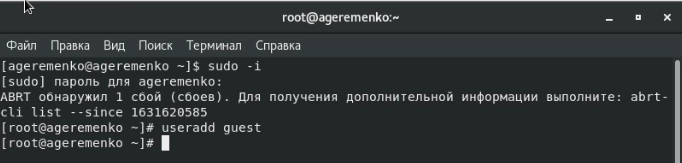{ #fig:001 width=100% }

## Установка пароля

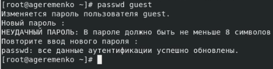{ #fig:002 width=100% }

## Вход в систему

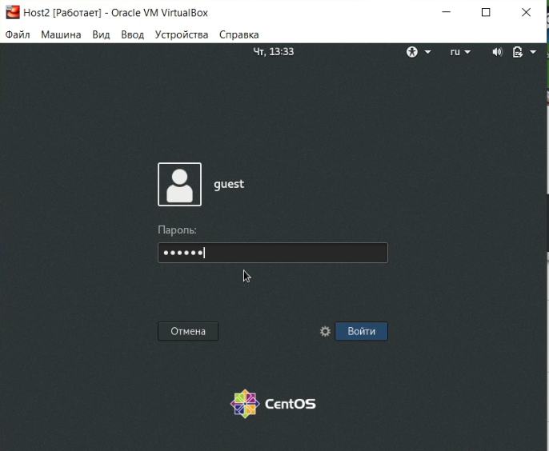{ #fig:003 width=100% }

## Вывод команды pwd

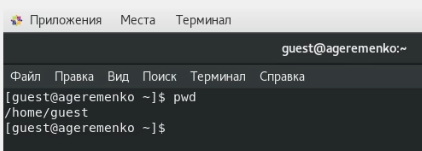{ #fig:004 width=100% }

## Вывод команды whoami

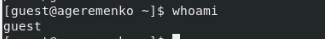{ #fig:005 width=100% }

## Вывод команд id и groups

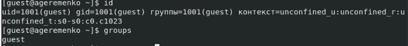{ #fig:006 width=100% }

## Приглашение командной строки

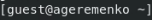{ #fig:007 width=100% }

## Проверка uid и gid

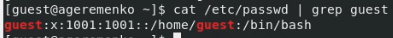{ #fig:008 width=100% }

## Список поддиректорий директории home

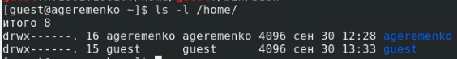{ #fig:009 width=100% }

## Проверка расширенных атрибутов

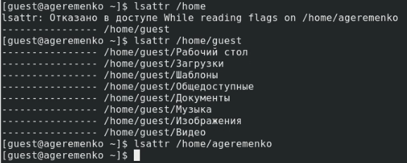{ #fig:010 width=100% }

## Создание dir1 и проверка атрибутов

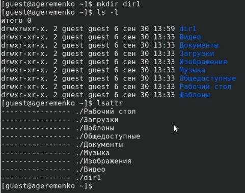{ #fig:011 width=100% }

## Снятие всех атрибутов

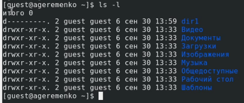{ #fig:012 width=100% }

## Попытки действий в каталоге без прав доступа

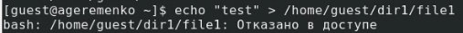{ #fig:013 width=100% }

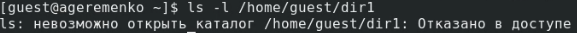{ #fig:014 width=100% }

## Изменения прав доступа

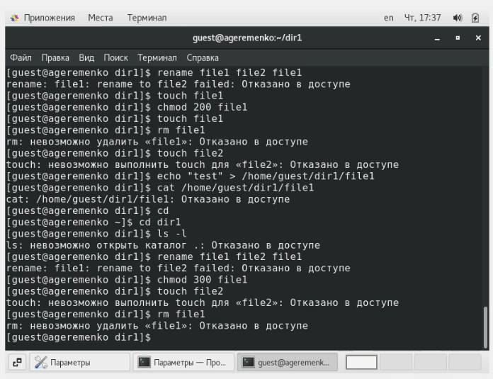{ #fig:015 width=100% }

## Табл.1 (1 ч.)

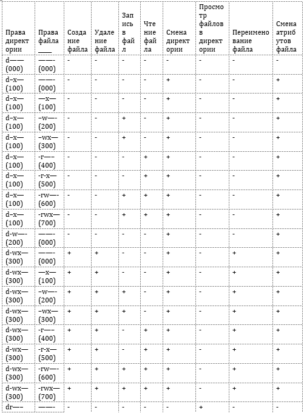{ #fig:015 width=50% }

## Табл.1 (2 ч.)

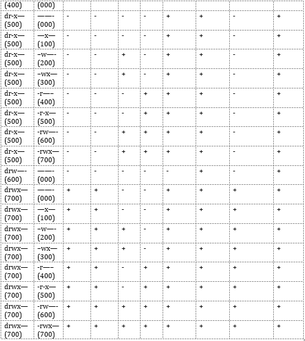{ #fig:015 width=60% }

## Табл. 2

Операция               | Мин. права на дир.| Мин. права на файл
-------------- | ----------------- | --------------
Создание файла         | d-wx--- (300)     | -------(000)
Удаление файла         | d-wx--- (300)     | -------(000)
Чтение файла           | d--x--- (100)     | -r-----(400)
Запись в файл          | d--x--- (100)     | --w----(200)
Переим. файла   | d-wx--- (300)     | -------(000)
Созд. поддиректории | d-wx--- (300)     | -------(000)
Удал. поддиректории | d-wx--- (300)     | -------(000)

## Выводы

Проделав данную лабораторную работу я получил практические навыки работы в консоли с атрибутами файлов, закрепление теоретических основ дискреционного разграничения доступа в современных системах с открытым кодом на базе ОС Linux.