---
# Front matter
lang: ru-RU
title: "Отчёт по лабораторной работе №2"
subtitle: "дисциплина: Информационная безопасность"
author: "Ерёменко Артём Геннадьевич, НПИбд-01-18"

# Formatting
toc-title: "Содержание"
toc: true # Table of contents
toc_depth: 2
lof: false # List of figures
lot: false # List of tables
fontsize: 12pt
linestretch: 1.5
papersize: a4paper
documentclass: scrreprt
polyglossia-lang: russian
polyglossia-otherlangs: english
mainfont: PT Serif
romanfont: PT Serif
sansfont: PT Sans
monofont: PT Mono
mainfontoptions: Ligatures=TeX
romanfontoptions: Ligatures=TeX
sansfontoptions: Ligatures=TeX,Scale=MatchLowercase
monofontoptions: Scale=MatchLowercase
indent: true
pdf-engine: lualatex
header-includes:
  - \linepenalty=10 # the penalty added to the badness of each line within a paragraph (no associated penalty node) Increasing the value makes tex try to have fewer lines in the paragraph.
  - \interlinepenalty=0 # value of the penalty (node) added after each line of a paragraph.
  - \hyphenpenalty=50 # the penalty for line breaking at an automatically inserted hyphen
  - \exhyphenpenalty=50 # the penalty for line breaking at an explicit hyphen
  - \binoppenalty=700 # the penalty for breaking a line at a binary operator
  - \relpenalty=500 # the penalty for breaking a line at a relation
  - \clubpenalty=150 # extra penalty for breaking after first line of a paragraph
  - \widowpenalty=150 # extra penalty for breaking before last line of a paragraph
  - \displaywidowpenalty=50 # extra penalty for breaking before last line before a display math
  - \brokenpenalty=100 # extra penalty for page breaking after a hyphenated line
  - \predisplaypenalty=10000 # penalty for breaking before a display
  - \postdisplaypenalty=0 # penalty for breaking after a display
  - \floatingpenalty = 20000 # penalty for splitting an insertion (can only be split footnote in standard LaTeX)
  - \raggedbottom # or \flushbottom
  - \usepackage{float} # keep figures where there are in the text
  - \floatplacement{figure}{H} # keep figures where there are in the text
---

# Цель работы

Получение практических навыков работы в консоли с атрибутами файлов, закрепление теоретических основ дискреционного разграничения доступа в современных системах с открытым кодом на базе ОС Linux.

# Выполнение лабораторной работы

1. В установленной при выполнении предыдущей лабораторной работы
операционной системе создал учётную запись пользователя guest (использую учётную запись администратора): (рис. [-@fig:001]).

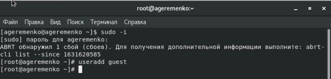{ #fig:001 width=70% }

2. Задал пароль для пользователя guest (использую учётную запись администратора)(рис. [-@fig:002]):

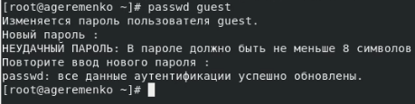{ #fig:002 width=70% }

3. Вошёл в систему от имени пользователя guest.([-@fig:003]).

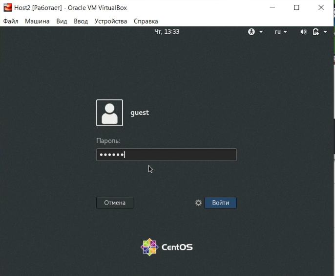{ #fig:003 width=70% }

4. Определил директорию, в которой нахожусь, командой pwd. Сравнил её с приглашением командной строки. Эта директория является
моей домашней директорией(рис. [-@fig:004]).

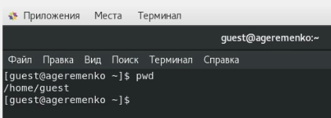{ #fig:004 width=70% }

5. Уточнил имя пользователя командой whoami.(рис. [-@fig:005]).

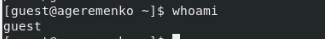{ #fig:005 width=70% }

6. Уточнил имя пользователя, его группу, а также группы, куда входит пользователь, командой id. Выведенные значения uid, gid и др. запомнил. Сравнил вывод id с выводом команды groups. (рис. [-@fig:006])

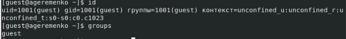{ #fig:006 width=70% }

7. Сравнил полученную информацию об имени пользователя с данными,
выводимыми в приглашении командной строки. (рис. [-@fig:007])

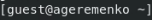{ #fig:007 width=70% }

8. Просмотрел файл /etc/passwd командой
cat /etc/passwd | grep guest
Определил uid пользователя (1001).
Определил gid пользователя (1001). Сравнил найденные значения с полученными в предыдущих пунктах (они совпадают).(рис. [-@fig:008]).

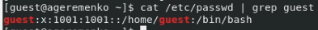{ #fig:008 width=70% }

9. Определил существующие в системе директории командой
ls -l /home/
Получил список поддиректорий директории /home .
На директориях установлены права 700, то есть доступ только для создателя.(рис. [-@fig:009]).

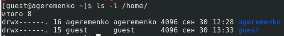{ #fig:009 width=70% }

10. Проверил, какие расширенные атрибуты установлены на поддиректориях, находящихся в директории /home, командой:
lsattr /home
Доступ к расширенным атрибутам запрещён.
Увидеть расширенные атрибуты директорий других
пользователей не удалось.(рис. [-@fig:010]).

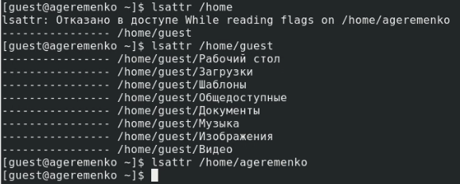{ #fig:010 width=70% }

11. Создал в домашней директории поддиректорию dir1 командой
mkdir dir1
Определил командами ls -l и lsattr, какие права доступа и расширенные атрибуты были выставлены на директорию dir1. (рис. [-@fig:011]).

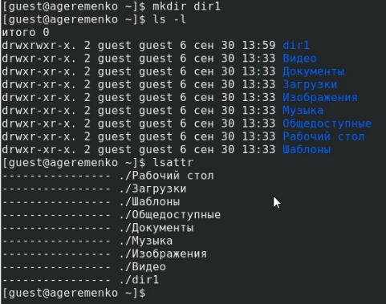{ #fig:011 width=70% }

12. Снял с директории dir1 все атрибуты командой
chmod 000 dir1
и проверил с её помощью правильность выполнения команды
ls -l(рис. [-@fig:012]).

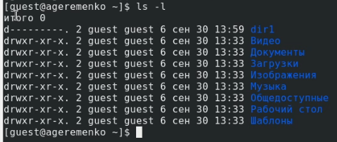{ #fig:012 width=70% }

13. Попытался создать в директории dir1 файл file1 командой
echo "test" > /home/guest/dir1/file1
Однако я получил отказ в выполнении операции по созданию файла, потому что я отключил все права, в том числе и на создание файлов. (рис. [-@fig:013])
Проверил командой ls -l /home/guest/dir1, что и доступ к просмотру каталога 
теперь тоже закрыт (рис. [-@fig:014]).

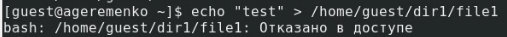{ #fig:013 width=70% }

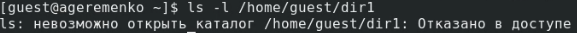{ #fig:014 width=70% }

14. Заполнил таблицу «Установленные права и разрешённые действия»
(см. табл. 1), выполняя действия от имени владельца директории (файлов), определив опытным путём, какие операции разрешены, а какие нет. (рис. [-@fig:015])
Если операция разрешена, заносил в таблицу знак «+», если не разрешена, знак «-».

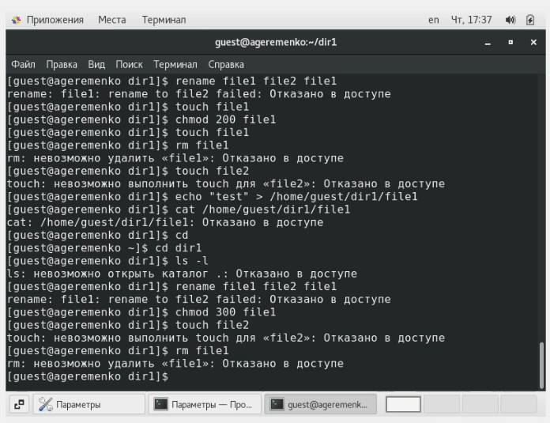{ #fig:015 width=70% }

		
Права директории | Права файла_____ | Создание файла | Удаление файла | Запись в файл | Чтение файла | Смена директории | Просмотр файлов в директории | Переименование файла | Смена атрибутов файла
------------- | ------------ | -- | ---- | ------ | ------ | ------ | ---------- | ------ | ---                       
d------ (000) |	-------(000) |  - |	-    |	-     |	-      |    -   |   -        |	-     | -
d--x--- (100) |	-------(000) |	- |	-    |	-     |	-      |	+   |	-        |	-     |	+
d--x--- (100) |	---x---(100) |	- |	-    |	-     |	-      |	+   |	-        |	-     |	+
d--x--- (100) |	--w----(200) |	- |	-    |	+     |	-      |	+   |	-        |	-     |	+
d--x--- (100) |	--wx---(300) |	- |	-    |	+     |	-      |	+   |	-        |	-     |	+
d--x--- (100) |	-r-----(400) |	- |	-    |	-     |	+      |	+   |	-        |	-     |	+
d--x--- (100) |	-r-x---(500) |	- |	-    |	-     |	+      |	+   |	-        |	-     |	+
d--x--- (100) |	-rw----(600) |	- |	-    |	+     |	+      |	+   |	-        |	-     |	+
d--x--- (100) |	-rwx---(700) |	- |	-    |	+     |	+      |	+   |	-        |	-     |	+ 
d-w---- (200) |	-------(000) |	- |	-    |	-     |	-      |	+   |	-        |	-     |	+
d-wx--- (300) |	-------(000) |	+ |	+    |	-     |	-      |	+   |	-        |	+     |	+
d-wx--- (300) |	---x---(100) |	+ |	+    |	-     |	-      |	+   |	-        |	+     |	+
d-wx--- (300) |	--w----(200) |	+ |	+    |	+     |	-      |	+   |	-        |	+     |	+
d-wx--- (300) |	--wx---(300) |	+ |	+    |	+     |	-      |	+   |	-        |	+     |	+
d-wx--- (300) |	-r-----(400) |	+ |	+    |	-     |	+      |	+   |	-        |	+     |	+
d-wx--- (300) |	-r-x---(500) |	+ |	+    |	-     |	+      |	+   |	-        |	+     |	+
d-wx--- (300) |	-rw----(600) |	+ |	+    |	+     |	+      |	+   |	-        |	+     |	+
d-wx--- (300) |	-rwx---(700) |	+ |	+    |	+     |	+      |	+   |	-        |	+     |	+
dr----- (400) |	-------(000) |	- |	-    |	-     |	-      |	-   |	+        |	-     |	-
dr-x--- (500) |	-------(000) |	- |	-    |	-     |	-      |	+   |	+        |	-     |	+
dr-x--- (500) |	---x---(100) |	- |	-    |	-     |	-      |	+   |	+        |	-     |	+
dr-x--- (500) |	--w----(200) |	- |	-    |	+     |	-      |	+   |	+        |	-     |	+
dr-x--- (500) |	--wx---(300) |	- |	-    |	+     |	-      |	+   |	+        |	-     |	+
dr-x--- (500) |	-r-----(400) |	- |	-    |	-     |	+      |	+   |	+        |	-     |	+
dr-x--- (500) |	-r-x---(500) |	- |	-    |	-     |	+      |	+   |	+        |	-     |	+
dr-x--- (500) |	-rw----(600) |	- |	-    |	+     |	+      |	+   |	+        |	-     |	+
dr-x--- (500) |	-rwx---(700) |	- |	-    |	+     |	+      |	+   |	+        |	-     |	+
drw---- (600) |	-------(000) |	- |	-    |	-     |	-      |	-   |	+        |	-     |	+
drwx--- (700) |	-------(000) |	+ |	+    |	-     |	-      |	+   |	+        |	+     |	+
drwx--- (700) |	---x---(100) |	+ |	+    |	-     |	-      |	+   |	+        |	+     |	+
drwx--- (700) |	--w----(200) |	+ |	+    |	+     |	-      |	+   |	+        |	+     |	+
drwx--- (700) |	--wx---(300) |	+ |	+    |	+     |	-      |	+   |	+        |	+     |	+
drwx--- (700) |	-r-----(400) |	+ |	+    |	-     |	+      |	+   |	+        |	+     |	+
drwx--- (700) |	-r-x---(500) |	+ |	+    |	-     |	+      |	+   |	+        |	+     |	+
drwx--- (700) |	-rw----(600) |	+ |	+    |	+     |	+      |	+   |	+        |	+     |	+
drwx--- (700) |	-rwx---(700) |	+ |	+    |	+     |	+      |	+   |	+        |	+     |	+

Табл. 1

15. На основании заполненной таблицы определил те или иные минимально необходимые права для выполнения операций внутри директории
dir1, заполнил табл. 2.

Операция               | Минимальные права на директорию | Минимальные права на файл
---------------------- | ----------------- | --------------
Создание файла         | d-wx--- (300)     | -------(000)
Удаление файла         | d-wx--- (300)     | -------(000)
Чтение файла           | d--x--- (100)     | -r-----(400)
Запись в файл          | d--x--- (100)     | --w----(200)
Переименование файла   | d-wx--- (300)     | -------(000)
Создание поддиректории | d-wx--- (300)     | -------(000)
Удаление поддиректории | d-wx--- (300)     | -------(000)

Табл. 2

# Выводы

Проделав данную лабораторную работу я получил практические навыки работы в консоли с атрибутами файлов, закрепление теоретических основ дискреционного разграничения доступа в современных системах с открытым кодом на базе ОС Linux.