---
## Front matter
lang: ru-RU
title: "Отчет по лабораторной работе №3"
author: |
	Artyom Gennadievich Yeryomenko
institute: |
	RUDN University, Moscow, Russian Federation

## Formatting
toc: false
slide_level: 2
theme: metropolis
header-includes: 
 - \metroset{progressbar=frametitle,sectionpage=progressbar,numbering=fraction}
 - '\makeatletter'
 - '\beamer@ignorenonframefalse'
 - '\makeatother'
aspectratio: 43
section-titles: true
---

# **Цель выполнения лабораторной работы**

## Цель

Получение практических навыков работы в консоли с атрибутами файлов для групп пользователей

# **Результаты выполнения лабораторной работы**

## Создание учётной записи guest2

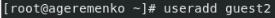{ #fig:001 width=100% }

## Установка пароля для guest2

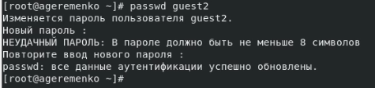{ #fig:002 width=100% }

## Добавление пользователя в группу

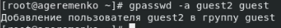{ #fig:003 width=100% }

## Вход в систему от пользователей guest и guest2

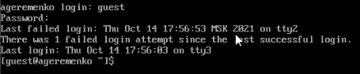{ #fig:004 width=100% }

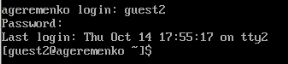{ #fig:005 width=100% }

## Вывод команды pwd для guest и guest2

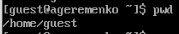{ #fig:006 width=100% }

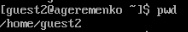{ #fig:007 width=100% }

## Проверка uid и gid у guest и guest2

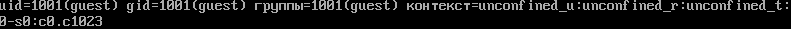{ #fig:008 width=100% }

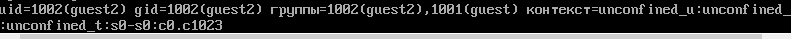{ #fig:009 width=100% }

## Вывод команд groups, id -Gn и id -G у guest и guest2

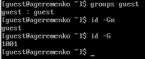{ #fig:010 width=80% }

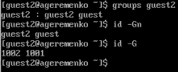{ #fig:011 width=80% }

## Cодержимое файла /etc/group

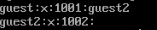{ #fig:012 width=100% }

## Регистрация пользователя guest2 в группе guest

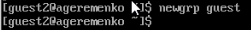{ #fig:013 width=100% }

## Изменение прав директории

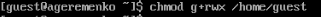{ #fig:014 width=100% }

## Снятие всех прав

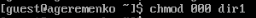{ #fig:015 width=100% }

## Табл.1 (1 ч.)

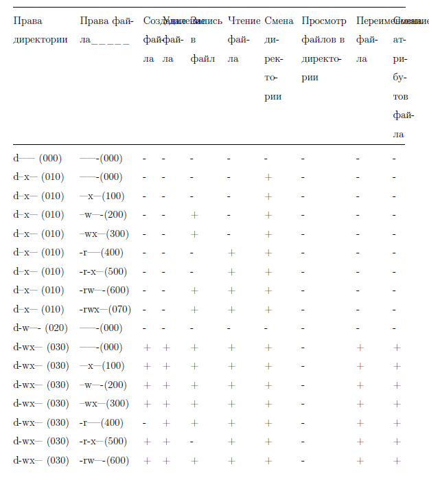{ #fig:016 width=50% }

## Табл.1 (2 ч.)

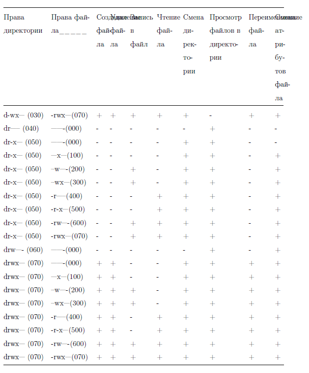{ #fig:017 width=60% }

## Табл. 2

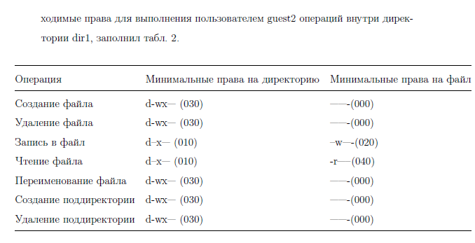{ #fig:018 width=100% }

## Выводы

Проделав данную лабораторную работу я получил практические навыки работы в консоли с атрибутами файлов для групп пользователей