---
## Front matter
lang: ru-RU
title: "Отчет по лабораторной работе №4"
author: |
	Artyom Gennadievich Yeryomenko
institute: |
	RUDN University, Moscow, Russian Federation

## Formatting
toc: false
slide_level: 2
theme: metropolis
header-includes: 
 - \metroset{progressbar=frametitle,sectionpage=progressbar,numbering=fraction}
 - '\makeatletter'
 - '\beamer@ignorenonframefalse'
 - '\makeatother'
aspectratio: 43
section-titles: true
---

# **Цель выполнения лабораторной работы**

## Цель

Получение практических навыков работы в консоли с расширенными атрибутами файлов

# **Результаты выполнения лабораторной работы**

## Просмотр расширенных атрибутов файла

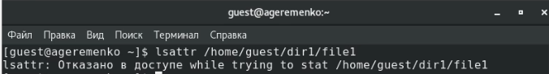{ #fig:001 width=100% }

## Установка прав доступа на file1

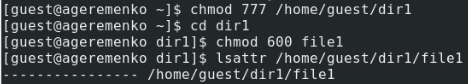{ #fig:002 width=100% }

## Установка расширенного атрибута на file1

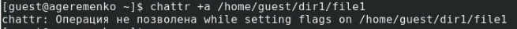{ #fig:003 width=100% }

## Установка расширенного атрибута на file1 от имени суперпользователя2

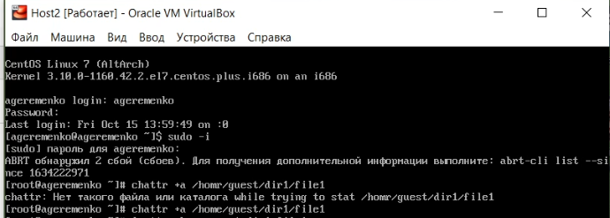{ #fig:004 width=100% }

## Проверка правильности установления атрибута

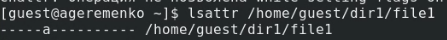{ #fig:005 width=100% }

## Дозапись в файл и проверка

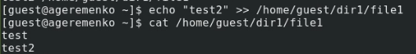{ #fig:006 width=100% }

## Проверка удаления файла, содержимого файла и переименования файла

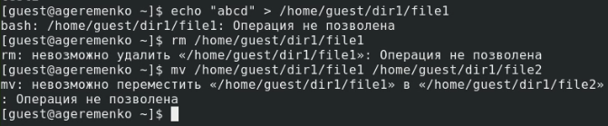{ #fig:007 width=100% }

## Попытка установить права доступа

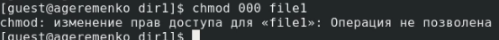{ #fig:008 width=100% }

## Снятие расширенного атрибута

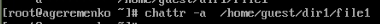{ #fig:009 width=100% }

## Повтор всех предыдущих операций

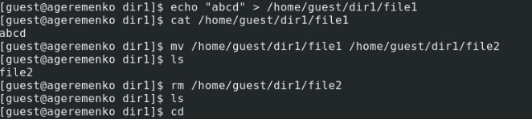{ #fig:010 width=80% }

## Установка расширенного атрибута i на file1 от имени суперпользователя

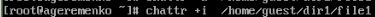{ #fig:011 width=80% }

## Повтор всех предыдущих операций

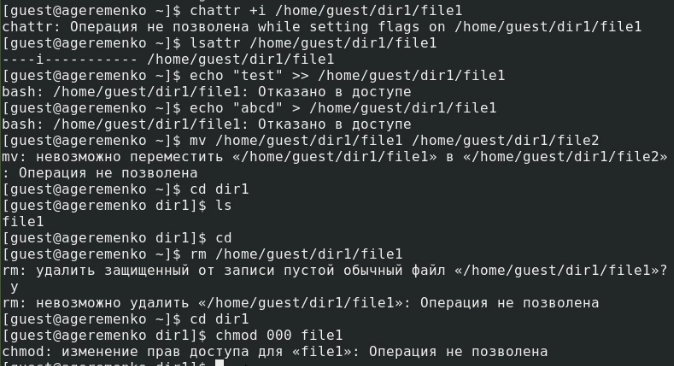{ #fig:012 width=100% }

## Выводы

Проделав данную лабораторную работу я получил практические навыки работы в консоли с расширенными атрибутами файлов