---
# Front matter
lang: ru-RU
title: "Отчёт по лабораторной работе №4"
subtitle: "дисциплина: Информационная безопасность"
author: "Ерёменко Артём Геннадьевич, НПИбд-01-18"

# Formatting
toc-title: "Содержание"
toc: true # Table of contents
toc_depth: 2
lof: false # List of figures
lot: false # List of tables
fontsize: 12pt
linestretch: 1.5
papersize: a4paper
documentclass: scrreprt
polyglossia-lang: russian
polyglossia-otherlangs: english
mainfont: PT Serif
romanfont: PT Serif
sansfont: PT Sans
monofont: PT Mono
mainfontoptions: Ligatures=TeX
romanfontoptions: Ligatures=TeX
sansfontoptions: Ligatures=TeX,Scale=MatchLowercase
monofontoptions: Scale=MatchLowercase
indent: true
pdf-engine: lualatex
header-includes:
  - \linepenalty=10 # the penalty added to the badness of each line within a paragraph (no associated penalty node) Increasing the value makes tex try to have fewer lines in the paragraph.
  - \interlinepenalty=0 # value of the penalty (node) added after each line of a paragraph.
  - \hyphenpenalty=50 # the penalty for line breaking at an automatically inserted hyphen
  - \exhyphenpenalty=50 # the penalty for line breaking at an explicit hyphen
  - \binoppenalty=700 # the penalty for breaking a line at a binary operator
  - \relpenalty=500 # the penalty for breaking a line at a relation
  - \clubpenalty=150 # extra penalty for breaking after first line of a paragraph
  - \widowpenalty=150 # extra penalty for breaking before last line of a paragraph
  - \displaywidowpenalty=50 # extra penalty for breaking before last line before a display math
  - \brokenpenalty=100 # extra penalty for page breaking after a hyphenated line
  - \predisplaypenalty=10000 # penalty for breaking before a display
  - \postdisplaypenalty=0 # penalty for breaking after a display
  - \floatingpenalty = 20000 # penalty for splitting an insertion (can only be split footnote in standard LaTeX)
  - \raggedbottom # or \flushbottom
  - \usepackage{float} # keep figures where there are in the text
  - \floatplacement{figure}{H} # keep figures where there are in the text
---

# Цель работы

Получение практических навыков работы в консоли с расширенными атрибутами файлов

# Выполнение лабораторной работы

1. От имени пользователя guest попытался определить расширенные атрибуты файла /home/guest/dir1/file1 , однако в доступе было отказано: (рис. [-@fig:001]).

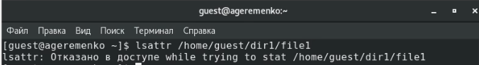{ #fig:001 width=70% }

2. Установил командой chmod 600 file1 на файл file1 права, разрешающие чтение и запись для владельца файла.(рис. [-@fig:002]):

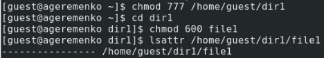{ #fig:002 width=70% }

3. Попробовал установить на файл /home/guest/dir1/file1 расширенный атрибут a от имени пользователя guest, но получил отказ от выполнения операции.([-@fig:003]).

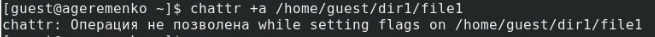{ #fig:003 width=70% }

4. Зашёл на третью консоль с правами администратора и установил расширенный атрибут a на файл /home/guest/dir1/file1 от имени суперпользователя:(рис. [-@fig:004]).

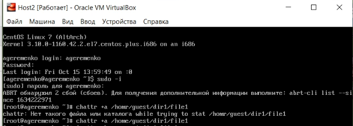{ #fig:004 width=70% }

5. От пользователя guest проверил правильность установления атрибута:(рис. [-@fig:005]).

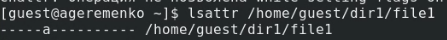{ #fig:005 width=70% }

6. Выполнил дозапись в файл file1 слова «test2» командой echo "test2" /home/guest/dir1/file1 и убедился, что слово test было успешно записано в file1: (рис. [-@fig:006])
 

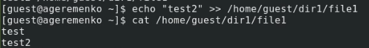{ #fig:006 width=70% }

7. Попробовал удалить файл file1 и стереть имеющуюся в нём информацию командой, а также переименовать файл.(рис. [-@fig:007])

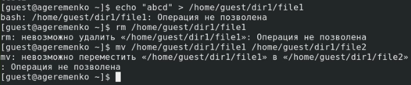{ #fig:007 width=70% }

8. Попробовал с помощью команды chmod 000 file1 установить на файл file1 права запрещающие чтение и запись для владельца файла, однако сделать это не удалось.(рис. [-@fig:008])

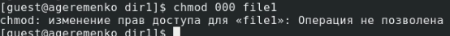{ #fig:008 width=70% }

9. Снял расширенный атрибута a с файла /home/guest/dirl/file1 от имени суперпользователя командой chattr -a /home/guest/dir1/file1 (рис. [-@fig:009])

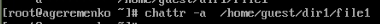{ #fig:009 width=70% }

Повторил операции, которые ранее не удавалось выполнить. Всё, кроме изменения прав на файл, удалось выполнить. (рис. [-@fig:010])

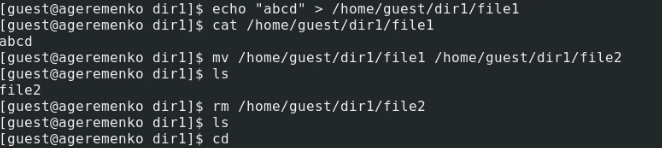{ #fig:010 width=70% }

10. Повторил действия по шагам, заменив атрибут «a» атрибутом «i». (рис. [-@fig:011])

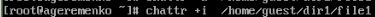{ #fig:011 width=70% }

Не удалось дозаписать информацию в файл.(рис. [-@fig:012])

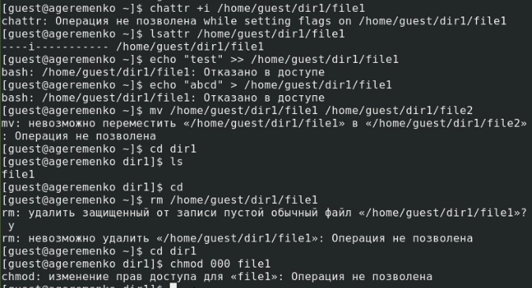{ #fig:012 width=70% }

# Выводы

Проделав данную лабораторную работу я получил практические навыки работы в консоли с расширенными атрибутами файлов