---
## Front matter
lang: ru-RU
title: "Отчет по лабораторной работе №5"
author: |
	Artyom Gennadievich Yeryomenko
institute: |
	RUDN University, Moscow, Russian Federation

## Formatting
toc: false
slide_level: 2
theme: metropolis
header-includes: 
 - \metroset{progressbar=frametitle,sectionpage=progressbar,numbering=fraction}
 - '\makeatletter'
 - '\beamer@ignorenonframefalse'
 - '\makeatother'
aspectratio: 43
section-titles: true
---

# **Цель выполнения лабораторной работы**

## Цель

Изучение механизмов изменения идентификаторов, применения
SetUID- и Sticky-битов. Получение практических навыков работы в кон-
соли с дополнительными атрибутами. Рассмотрение работы механизма
смены идентификатора процессов пользователей, а также влияние бита
Sticky на запись и удаление файлов.

# **Результаты выполнения лабораторной работы**

## Вход в систему под guest

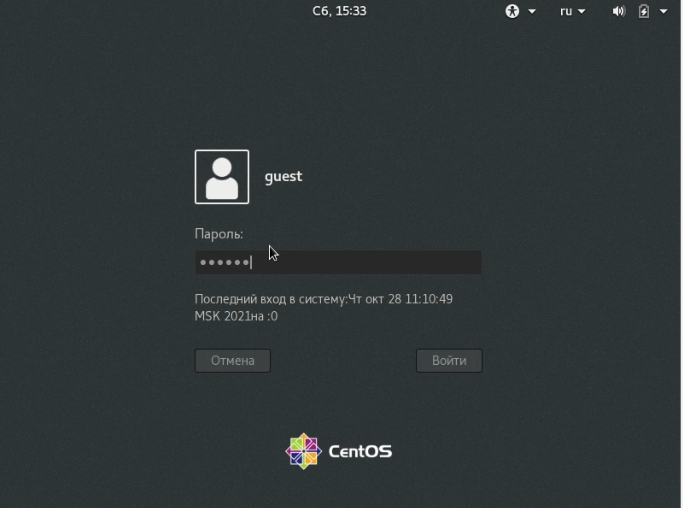{ #fig:001 width=100% }

## Создание simpleid.c

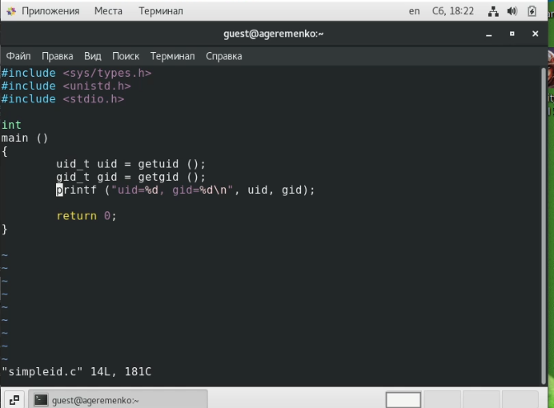{ #fig:002 width=100% }

## Компиляция

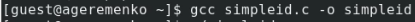{ #fig:003 width=100% }

## Выполнение программы

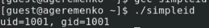{ #fig:004 width=100% }

## Выполнение id

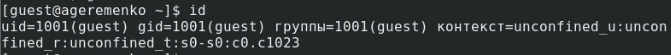{ #fig:005 width=100% }

## Усложнение программы

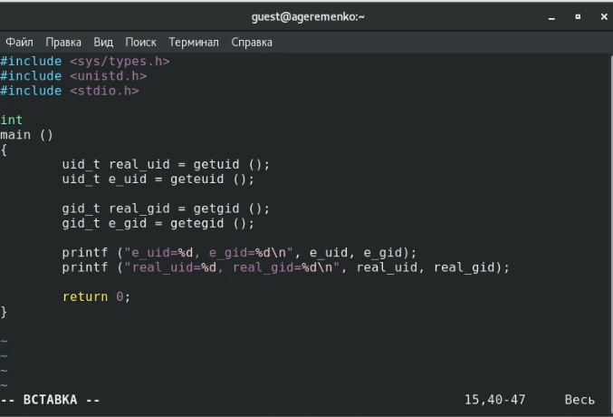{ #fig:006 width=100% }

## Компиляция и запуск

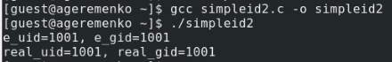{ #fig:007 width=100% }

## Изменение прав

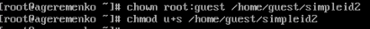{ #fig:008 width=100% }

## Использование sudo

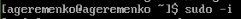{ #fig:009 width=100% }

## Выполнение проверки

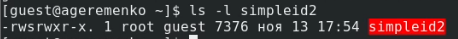{ #fig:010 width=80% }

## Запуск simpleid2 и id

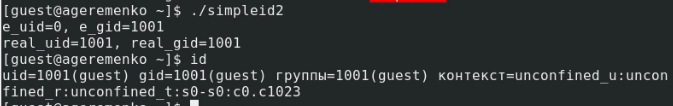{ #fig:011 width=80% }

## Аналогичные действия для SetGID-бита

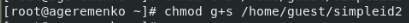{ #fig:012 width=100% }

## Создание readfile.c

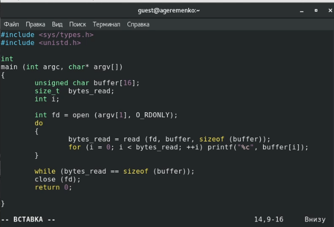{ #fig:013 width=100% }

## Компиляция readfile.c

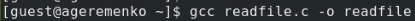{ #fig:012 width=100% }

## Выводы

Проделав данную лабораторную работу я изученил механизмы изменения идентификаторов, применения
SetUID- и Sticky-битов. Полученил практические навыки работы в кон-
соли с дополнительными атрибутами. Рассмотрел работы механизма
смены идентификатора процессов пользователей, а также влияние бита
Sticky на запись и удаление файлов.