---
# Front matter
lang: ru-RU
title: "Отчёт по лабораторной работе №5"
subtitle: "дисциплина: Информационная безопасность"
author: "Ерёменко Артём Геннадьевич, НПИбд-01-18"

# Formatting
toc-title: "Содержание"
toc: true # Table of contents
toc_depth: 2
lof: false # List of figures
lot: false # List of tables
fontsize: 12pt
linestretch: 1.5
papersize: a4paper
documentclass: scrreprt
polyglossia-lang: russian
polyglossia-otherlangs: english
mainfont: PT Serif
romanfont: PT Serif
sansfont: PT Sans
monofont: PT Mono
mainfontoptions: Ligatures=TeX
romanfontoptions: Ligatures=TeX
sansfontoptions: Ligatures=TeX,Scale=MatchLowercase
monofontoptions: Scale=MatchLowercase
indent: true
pdf-engine: lualatex
header-includes:
  - \linepenalty=10 # the penalty added to the badness of each line within a paragraph (no associated penalty node) Increasing the value makes tex try to have fewer lines in the paragraph.
  - \interlinepenalty=0 # value of the penalty (node) added after each line of a paragraph.
  - \hyphenpenalty=50 # the penalty for line breaking at an automatically inserted hyphen
  - \exhyphenpenalty=50 # the penalty for line breaking at an explicit hyphen
  - \binoppenalty=700 # the penalty for breaking a line at a binary operator
  - \relpenalty=500 # the penalty for breaking a line at a relation
  - \clubpenalty=150 # extra penalty for breaking after first line of a paragraph
  - \widowpenalty=150 # extra penalty for breaking before last line of a paragraph
  - \displaywidowpenalty=50 # extra penalty for breaking before last line before a display math
  - \brokenpenalty=100 # extra penalty for page breaking after a hyphenated line
  - \predisplaypenalty=10000 # penalty for breaking before a display
  - \postdisplaypenalty=0 # penalty for breaking after a display
  - \floatingpenalty = 20000 # penalty for splitting an insertion (can only be split footnote in standard LaTeX)
  - \raggedbottom # or \flushbottom
  - \usepackage{float} # keep figures where there are in the text
  - \floatplacement{figure}{H} # keep figures where there are in the text
---

# Цель работы

Изучение механизмов изменения идентификаторов, применения
SetUID- и Sticky-битов. Получение практических навыков работы в кон-
соли с дополнительными атрибутами. Рассмотрение работы механизма
смены идентификатора процессов пользователей, а также влияние бита
Sticky на запись и удаление файлов.

# Выполнение лабораторной работы

1. Вошёл в систему от имени пользователя guest(рис. [-@fig:001]).

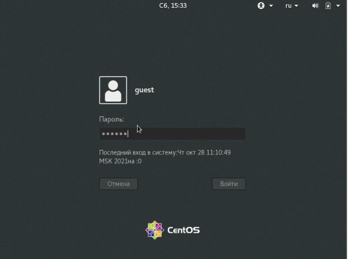{ #fig:001 width=70% }

2. Создал программу simpleid.c(рис. [-@fig:002]):

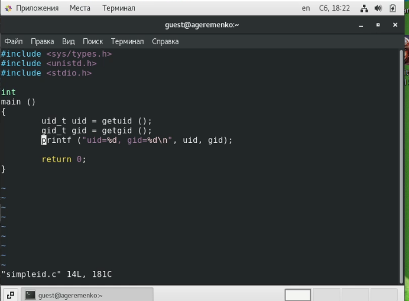{ #fig:002 width=70% }

3. Скомплилировал программу и убедился, что файл программы создан([-@fig:003]).

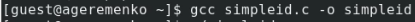{ #fig:003 width=70% }

4. Выполнил программу simpleid(рис. [-@fig:004]).

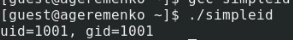{ #fig:004 width=70% }

5. Выполнил системную программу id(рис. [-@fig:005]).

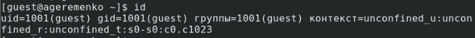{ #fig:005 width=70% }

6. Усложнил программу, добавив вывод действительных идентификаторов(рис. [-@fig:006])
 

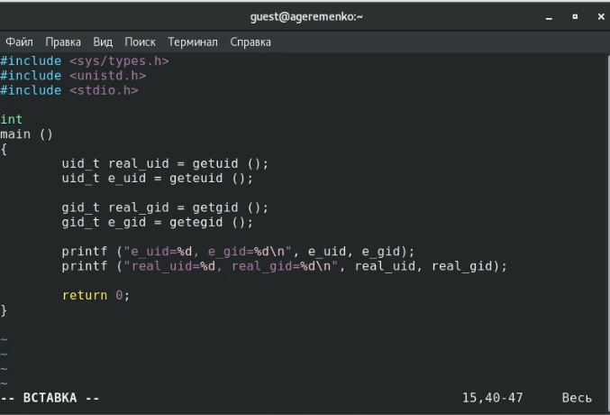{ #fig:006 width=70% }

7. Скомпилировал и запустил simpleid2.c(рис. [-@fig:007])

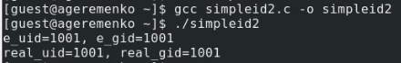{ #fig:007 width=70% }

8. От имени суперпользователя выполнил команды(рис. [-@fig:008])

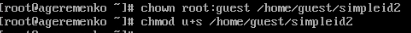{ #fig:008 width=70% }

9. Использовал sudo (рис. [-@fig:009])

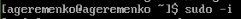{ #fig:009 width=70% }

10. Выполнил проверку правильности установки новых атрибутов и смены владельца файла simpleid2. (рис. [-@fig:010])

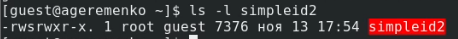{ #fig:010 width=70% }

11. Запустил simpleid2 и id (рис. [-@fig:011])

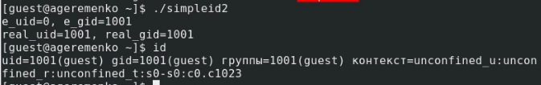{ #fig:011 width=70% }

12. Проделал тоже самое относительно SetGID-бита (рис. [-@fig:012])

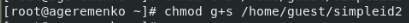{ #fig:012 width=70% }

13. Создал программу readfile.c

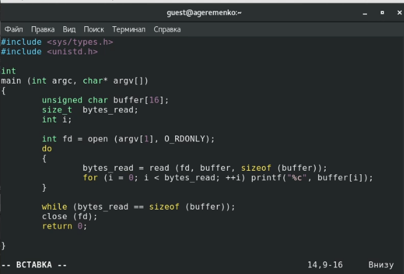{ #fig:013 width=70% }

14. Откомпилировал её

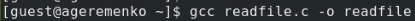{ #fig:014 width=70% }

# Выводы

Проделав данную лабораторную работу я изученил механизмы изменения идентификаторов, применения
SetUID- и Sticky-битов. Полученил практические навыки работы в кон-
соли с дополнительными атрибутами. Рассмотрел работы механизма
смены идентификатора процессов пользователей, а также влияние бита
Sticky на запись и удаление файлов.